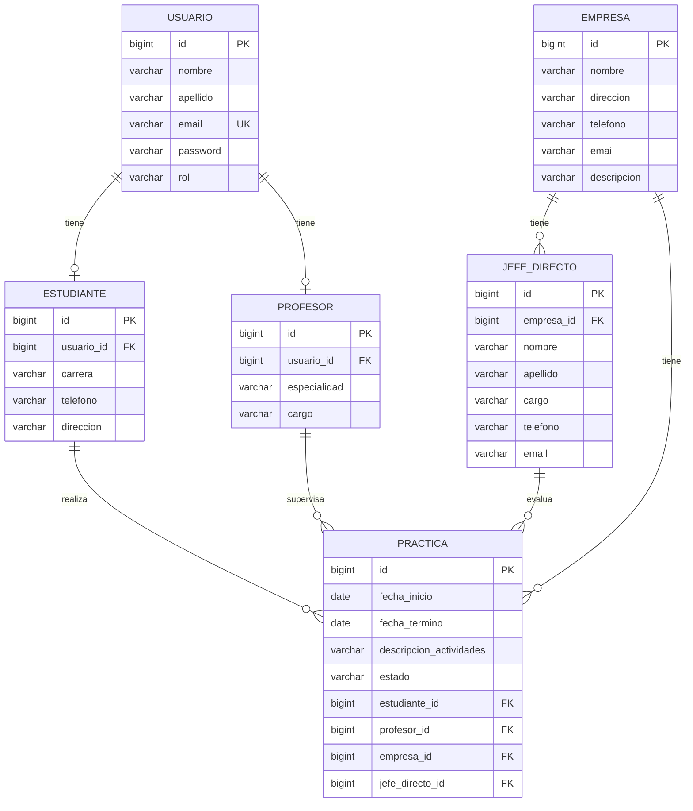

# Informe técnico: sistema de gestión de prácticas profesionales

## 1. Objetivo del proyecto

Este proyecto implementa un sistema de gestión para coordinar prácticas profesionales entre estudiantes, profesores, empresas y jefes directos. La solución está construida con Java 21 y Spring Boot 3.3.4, usando PostgreSQL 15 como motor de base de datos y JPA/Hibernate como capa de persistencia.

## 2. Requisitos funcionales cubiertos

- Registro y autenticación de usuarios con JWT.
- Roles y permisos por perfil: estudiante y profesor.
- CRUD completo de usuarios, estudiantes, profesores, empresas, jefes directos y prácticas.
- Validaciones de datos en backend con `@Valid`.
- Manejo centralizado de errores con `@RestControllerAdvice`.
- Datos semilla para pruebas funcionales.
- Scripts SQL para recrear y cargar el modelo de datos.

## 3. Arquitectura implementada

El proyecto sigue un patrón de n capas:

- `entity`: entidades JPA.
- `repository`: acceso a datos con Spring Data JPA.
- `service`: lógica y validaciones de negocio.
- `controller`: endpoints REST.
- `dto`: objetos de entrada/salida.
- `security`: autenticación JWT y autorización.
- `exception`: manejo de errores.

## 4. Diagrama de base de datos

## 5. Descripción de las entidades y relaciones

### Usuarios
- Tabla central con credenciales y rol.
- Un usuario puede ser estudiante o profesor.
- Se valida que el email sea único.

### Estudiantes
- Relación uno a uno con `Usuario`.
- Poseen carrera, teléfono y dirección.

### Profesores
- Relación uno a uno con `Usuario`.
- Poseen especialidad y cargo.

### Empresas
- Representan organizaciones donde se desarrollan las prácticas.
- Pueden tener varios jefes directos y varias prácticas.

### Jefes directos
- Pertenecen a una empresa.
- Supervisan o validan la práctica del estudiante.

### Prácticas
- Relación con estudiante, profesor, empresa y jefe directo.
- Incluye fechas, descripción, estado y validaciones por negocio.

## 6. Soluciones implementadas

### 6.1 Seguridad y autenticación

Se aplicó Spring Security con JWT para proteger endpoints y controlar acceso por perfil.

- `AuthController` expone `/api/auth/login` y `/api/auth/register`.
- `JwtService` genera y valida tokens.
- `JwtAuthenticationFilter` interpreta el header `Authorization: Bearer ...`.
- `SecurityConfig` define reglas por rol y ruta.
- El hash de contraseñas se realiza con `BCryptPasswordEncoder`.

### 6.2 Validaciones de negocio

La capa de servicios valida:

- datos obligatorios,
- email válido,
- fechas coherentes,
- relación del jefe directo con la empresa,
- existencia de registros relacionados,
- empresa, profesor, estudiante y jefe directo en las prácticas.

Los errores se gestionan mediante `ApiExceptionHandler` para responder con JSON estructurado y código HTTP adecuado.

### 6.3 Persistencia y base de datos

Se usa Spring Data JPA para persistir entidades PostgreSQL con relaciones de entidad. Los scripts SQL en `src/main/resources/schema.sql` y `db/init-db.sql` permiten:

- crear el esquema,
- recrearlo desde cero,
- cargar datos semilla para pruebas,
- validar el flujo sin intervención manual compleja.

### 6.4 Datos semilla

Se cargan usuarios de prueba con credenciales demo:

- Ana García: estudiante, `ana.garcia@email.com`, password `123456`
- Luis Pérez: profesor, `luis.perez@email.com`, password `123456`
- Marta Ruiz: estudiante, `marta.ruiz@email.com`, password `123456`

## 7. Pruebas y verificación

Se validó:

- levantamiento del proyecto con Java 21,
- conexión a PostgreSQL usando Docker,
- login con JWT,
- acceso a rutas protegidas con token válido,
- CRUD de entidades principales,
- compilación con Maven y ejecución de tests de contexto.

## 8. Documentación adicional

- README general del proyecto: documentación de setup y uso.
- Colección Bruno: pruebas automáticas para todos los endpoints.
- Scripts SQL en `db/` para recreación y seed.

## 9. Conclusión

La solución entrega una base sólida para la gestión de prácticas profesionales con una arquitectura mantenible, seguridad real y un modelo de datos funcional y escalable.
