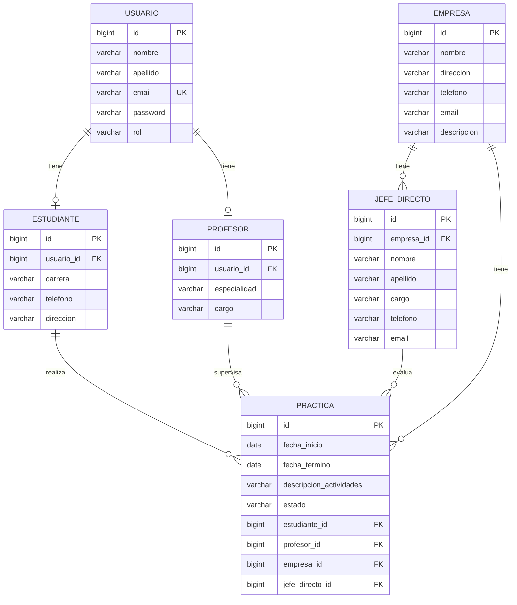

# Informe técnico: sistema de gestión de prácticas profesionales

## 1. Objetivo del proyecto

Este proyecto implementa una solución backend para gestionar prácticas profesionales entre estudiantes, profesores, empresas y jefes directos. La aplicación está construida con Java 21 y Spring Boot 3.3.4, usa PostgreSQL 15 como base de datos relacional y Spring Data JPA como capa de persistencia.

El objetivo principal es centralizar la gestión del proceso de prácticas: registro de usuarios, asignación de roles, creación de empresas y jefes, y coordinación de la práctica profesional con supervisión académica y empresarial.

## 2. Requisitos funcionales cubiertos

- Registro y autenticación de usuarios
- JWT para acceso seguro a la API
- Perfiles de estudiante y profesor
- CRUD completo para usuarios, estudiantes, profesores, empresas, jefes directos y prácticas
- Validaciones de entrada con `@Valid`
- Manejo centralizado de errores con `@RestControllerAdvice`
- Scripts SQL para recrear la BD y cargar datos semilla
- Colección Bruno para pruebas de endpoints
- Parametrización por entorno y variables de configuración

## 3. Arquitectura implementada

El proyecto sigue un patrón de n capas:

- `entity`: entidades JPA
- `repository`: persistencia con Spring Data JPA
- `service`: lógica y validaciones de negocio
- `controller`: endpoints REST
- `dto`: DTOs de entrada y salida
- `security`: autenticación JWT y configuración de seguridad
- `exception`: errores y respuestas estándar

Este diseño separa responsabilidades y facilita mantenimiento, prueba unitaria y extensión del sistema.

## 4. Modelo de datos

### 4.1 Entidades principales

#### Usuario

- `id`
- `nombre`
- `apellido`
- `email`
- `password`
- `rol`

#### Estudiante

- `id`
- `usuario_id`
- `carrera`
- `telefono`
- `direccion`

#### Profesor

- `id`
- `usuario_id`
- `especialidad`
- `cargo`

#### Empresa

- `id`
- `nombre`
- `direccion`
- `telefono`
- `email`
- `descripcion`

#### JefeDirecto

- `id`
- `nombre`
- `apellido`
- `cargo`
- `telefono`
- `email`
- `empresa_id`

#### Practica

- `id`
- `fecha_inicio`
- `fecha_termino`
- `descripcion_actividades`
- `estado`
- `estudiante_id`
- `profesor_id`
- `empresa_id`
- `jefe_directo_id`

## 5. Diagrama de base de datos



## 6. Relación entre entidades

### Usuario y perfil

El usuario es la entidad base de autenticación. A partir de este registro se crea, según el rol, un perfil de estudiante o profesor. La relación se modela como 1:1. Esto permite centralizar credenciales y roles sin duplicar la identidad de la persona.

### Empresa y jefe directo

La empresa puede tener varios jefes directos. El jefe directo pertenece a una empresa y es la referencia profesional que valida o supervisa la práctica.

### Estudiante, profesor y práctica

Una práctica se realiza entre:

- un estudiante
- un profesor supervisor
- una empresa
- un jefe directo asociada a esa empresa

Esto garantiza que cada práctica quede vinculada al contexto real del proceso formativo.

## 7. Seguridad y autenticación

La aplicación usa `Spring Security` con JWT para proteger rutas internas.

### Flujo

1. El cliente envía `POST /api/auth/login` con email y password.
2. La app valida credenciales usando `AuthenticationManager`.
3. Si son correctas, genera un token JWT con email, rol y data del usuario.
4. El cliente envía el token en el header `Authorization: Bearer <token>`.
5. El `JwtAuthenticationFilter` valida la firma y establece el contexto de seguridad del usuario.

### Roles por acceso

- `ROLE_ESTUDIANTE`: acceso limitado a lectura y perfil propio
- `ROLE_PROFESOR`: acceso administrativo sobre entidades principales del sistema

### Encriptación de contraseñas

Las contraseñas se almacenan con `BCryptPasswordEncoder`, evitando guardar texto plano en la BD.

## 8. Validaciones de negocio

La capa de servicios valida los siguientes aspectos:

- email único por usuario
- email válido y no vacío
- nombre y apellido obligatorios
- carrera obligatoria para estudiantes
- especialidad obligatoria para profesores
- empresa, profesor, estudiante y jefe directo obligatorios al crear una práctica
- fechas de inicio y término coherentes
- jefe directo asociado a la empresa indicada
- no duplicar registros de perfil por usuario

Estas validaciones se aplican en servicios y se resuelven con errores propios del dominio (`BusinessException`, `ResourceNotFoundException`).

## 9. Scripts SQL y datos semilla

Se entregan dos scripts principales en `db/`:

- `db/init-db.sql`: elimina tablas, recrea el esquema y carga datos de ejemplo
- `db/seed.sql`: inserta datos semilla sin recrear estructura

Los datos semilla incluyen usuarios con credenciales de ejemplo:

- Ana García: `ana.garcia@email.com` / `123456`
- Luis Pérez: `luis.perez@email.com` / `123456`
- Marta Ruiz: `marta.ruiz@email.com` / `123456`

## 10. Configuración por ambiente

La app usa perfiles y variables de entorno para evitar hardcodear valores locales. Las propiedades relevantes se leen desde:

- `application.properties`
- `application-dev.properties`
- `application-prod.properties`

Ejemplos de configuración:

- `DB_URL`
- `DB_USERNAME`
- `DB_PASSWORD`
- `SERVER_PORT`
- `SPRING_PROFILES_ACTIVE`
- `JPA_DDL_AUTO`
- `JPA_SHOW_SQL`
- `JWT_SECRET`

Esto permite mover la aplicación entre entorno local, pruebas y producción con cambios mínimos.

## 11. Colección Bruno

Se incluye la carpeta `bruno/` con requests HTTP para pruebas manuales y automatizadas de endpoints.

La colección ayuda a validar:

- login y registro
- creación y consulta de usuarios
- operaciones CRUD de empresas, prácticas y perfiles
- autorización por JWT

Nota importante: Bruno requiere que el body de request con `body: json` esté encapsulado en una pareja extra de llaves, por ejemplo:

```bru
body:json {
  {
    "email": "ana.garcia@email.com",
    "password": "123456"
  }
}
```

## 12. Pruebas y verificación

Se validó que el proyecto:

- compila con Java 21
- arranca con Spring Boot 3.3.4
- se conecta correctamente a PostgreSQL 15 en Docker
- autentica con JWT
- protege rutas según permisos de rol
- permite CRUD sobre entidades principales
- maneja errores de validación y negocio con mensajes claros

## 13. Conclusión

La solución implementada entrega una base sólida para la gestión de prácticas profesionales, con una estructura ordenada, seguridad adecuada, persistencia real con PostgreSQL, validaciones de negocio y documentación de uso. Es una base adecuada para continuar con nuevas funcionalidades, métricas o reportes del sistema.